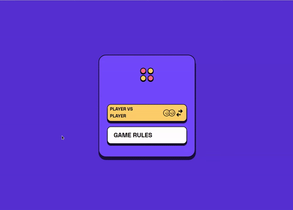

# Project : React Connect 4 Game

## Table of contents

- [The challenge](#the-challenge)
- [Screenshot](#screenshot)
- [Project Skeleton ](#project-skeleton)
- [Links](#links)
- [Built with](#built-with)
- [Useful resources](#useful-resources)
- [Author](#author)

## The challenge

The aim of this project is to create a game with given figma design. All codes and algorithms are totally written by me.

## Links

<b>Check out the </b> <a href="https://4in4game.netlify.app/">Live Website</a>

## Screenshot

## Built with

- React
- React Router
- SASS and CSS module system
- Bootstrap
- Figma

## Useful resources

- [W3 Schoold](https://www.w3schools.com/) - This helped me for basics of website paradigm. I really liked this pattern and will use it going forward.
- [MDN](https://developer.mozilla.org/en-US/) - This is an amazing document which helped me finally understand deep sides of web development. I'd recommend it to anyone still learning these concepts.

## Author

- Author - [Vyashvardhan]
